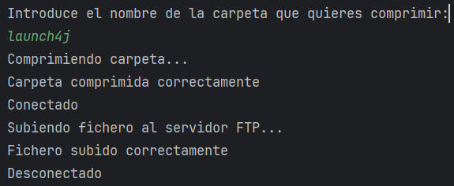

# Gestor de Copias de Seguridad con Java

---

## 1. Diseño de la Aplicación
La aplicación se ha diseñado para que sea lo más sencilla posible, 
de manera que cualquier usuario pueda utilizarla sin necesidad de conocimientos previos. 
Para ello, se ha optado por una interfaz gráfica que permita al usuario seleccionar los archivos que desea copiar y el destino de la copia.

---

## Análisis de funcionamiento

---

## Pruebas

---

## Propuesta de mejoras

Una mejora que se podría implementar es que también compruebe la fecha de modificación de los archivos, para poder actualizar en caso de que alguno de ellos haya sido modificado pero su nombre o ubicación no haya cambiado.

--- 

## Enlace a el Proyecto

https://github.com/Laesx/GestorFTP