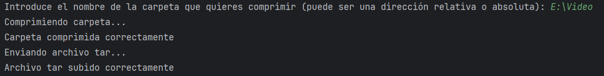
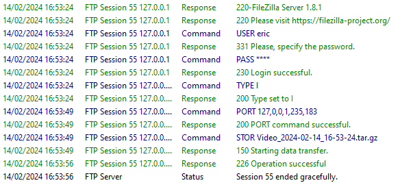
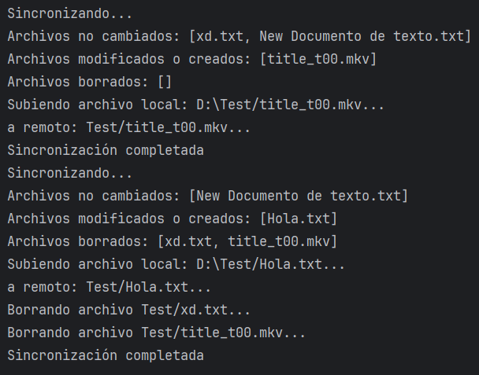
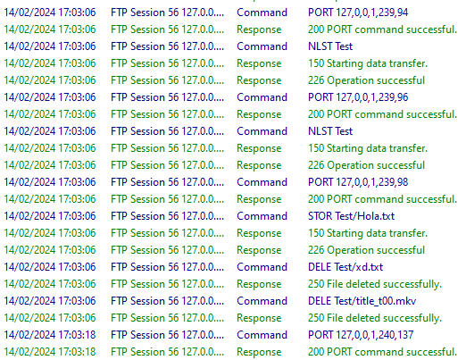

# Gestor de Copias de Seguridad con Java

---

## 1. Diseño de la Aplicación
La aplicación tiene 2 partes, una que se encarga de subir una carpeta al servidor FTP y otra que se encarga de 
sincronizar una carpeta local con una carpeta remota en el servidor FTP.

---

### Clase GestorFTP
La clase GestorFTP es la encargada de gestionar la conexión con el servidor FTP. Esta clase se encarga de conectarse y 
desconectarse del servidor, así como de realizar operaciones de FTP como subir y descargar archivos.

La podemos usar de 2 maneras:
 - Crear una instancia, pasándole la carpeta que queremos enviar y luego iniciar el hilo, que conectará comprimirá y enviara el archivo.
 - Crear una instancia vacía y usar los métodos que nos facilita.

---

### Clase SincronizadorFTP
La clase SincronizadorFTP se encarga de sincronizar una carpeta local con una carpeta remota en el servidor FTP.
Esta clase utiliza la clase GestorFTP para realizar las operaciones de FTP necesarias para la sincronización. 
La sincronización se realiza en un bucle infinito, con un tiempo de refresco configurable.

---

### Clase Main
La clase Main es la encargada de iniciar la aplicación. Esta clase solicita al usuario el nombre de la 
carpeta que desea comprimir y luego inicia un nuevo hilo con una instancia de la clase GestorFTP para 
realizar la compresión y la transferencia de la carpeta al servidor FTP.

---

## 2. Análisis de funcionamiento (GestorFTP)

Iniciamos la Aplicación por el main, que nos pedirá el nombre de la carpeta que queremos comprimir y subir al servidor FTP.
Una vez introducido el nombre de la carpeta, se inicia un nuevo hilo con una instancia de la clase GestorFTP 
para realizar la compresión y la transferencia de la carpeta al servidor FTP.

---

### Log de FTP
En el log de FTP podemos ver como se realiza la conexión con el servidor FTP y se sube el archivo.

---

### Archivo creado
Aquí podemos ver como nos ha creado un archivo temporal de la carpeta que hayamos indicado.

Y como nos ha guardado el zip en el servidor FTP:

---

## 2.1. Análisis de funcionamiento (SincronizadorFTP)

La clase SincronizadorFTP primero lee todos los archivos del remoto y de la carpeta local y los guarda en 2 sets de archivos.
Luego compara los archivos de ambos sets y si hay archivos que no están en el remoto, los sube, si hay archivos que no están en la carpeta local, los descarga.

---

### Prueba de sincronización

En este ejemplo añado un archivo a la carpeta local, a otro le cambio el nombre y el archivo que añadí, lo borro.

---

### Log de FTP
En el log de FTP podemos ver como se realizan las operaciones con el servidor FTP.

---

Si analizamos el log del FTP vemos que primero lista el directorio donde se van a guardar nuestro archivos, luego la aplicación lo compara con la lista de archivos que tiene del directorio local y si hay alguna modificación la refleja. Por ejemplo aquí guarda el archivo Hola.txt y borra title_t00.mkv.

---

## 3. Pruebas

Hice muchas pruebas

---

## 4. Propuesta de mejoras

Una mejora que se podría implementar es que también compruebe 
el hash de los archivos para saber si los archivos han cambiado o comprobar que todos los archivos se han copiado de forma integra en el directorio FTP.

--- 

## Enlace a el Proyecto

https://github.com/Laesx/GestorFTP